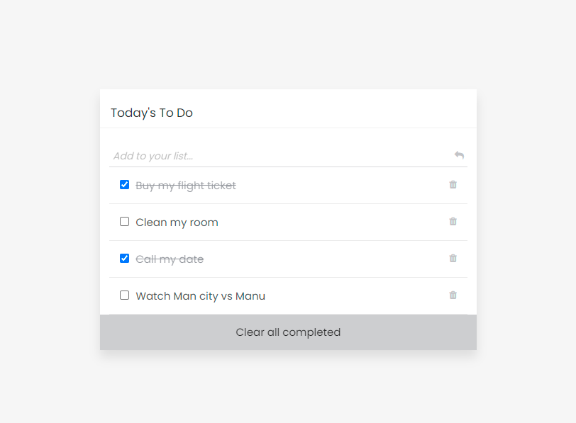

# Building a To-do list App (CRUD)

In this project, you will implement the CRUD (create, update, delete) methods. All the elements of the user interface will be fully functional and your application will be completed.

 

## Live Demo

[Live Demo Link](https://codecaiine.github.io/todo-list-app/)
 
## Built 
- HTML
- CSS
- Javascript
- Webpack 
- HTML&CSS Linter
- Git

## Get Started

Please get your browser update.
To get a local copy up and running follow these simple steps.

Run the command below from the Terminal:

      git clone <URL> in your terminal

	  cd todo-list-app

	  npm install

	  npm run build

	  npm run start

	  npx hint

	  npx stylelint "**/*.{css,scss}"

## Authors

👤 **Yannick-Noel AKA**

- Location: Côte d'Ivoire
- GitHub: [@codecaiine](https://github.com/codecaiine)
- Twitter: [@yannicknaka](https://twitter.com/yannicknaka)
- LinkedIn: [LinkedIn](https://www.linkedin.com/in/yannick-no%C3%ABl-aka/)

## 🤝 Contributing

Contributions, issues, and feature requests are welcome!

Feel free to check the [issues page](https://github.com/codecaiine/todo-list-app/issues).

## Show your support

Give a ⭐️ if you like this project!

## Acknowledgments

- Thanks to Microverse
- Adedamola Shittu

## 📝 License

This project is [MIT](./MIT.md) licensed.
